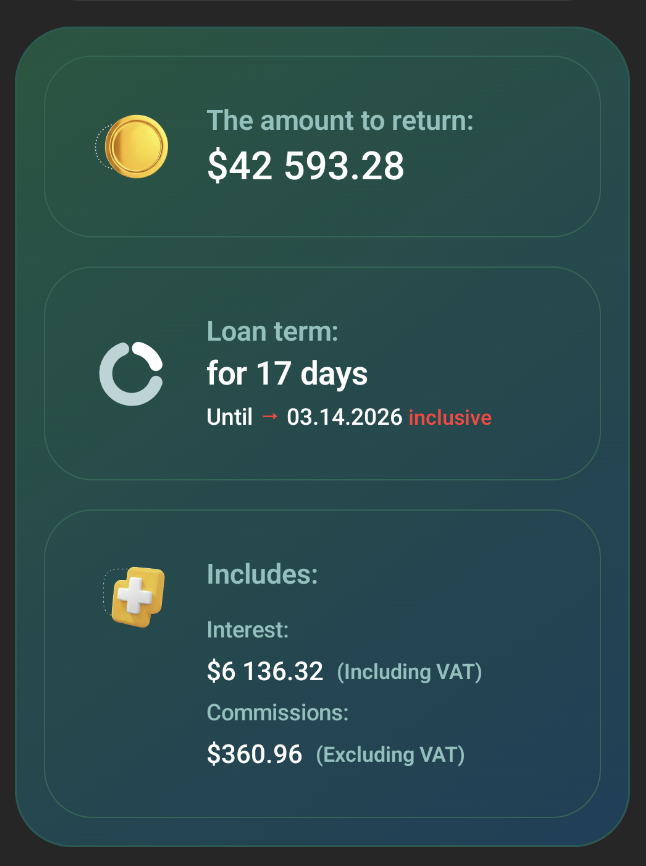

# Loan Calculator

Android loan calculator app. Kotlin, Jetpack Compose, Material 3, Redux/UDF architecture.

## Screenshots

| | | |
|:---:|:---:|:---:|
|  |  |  |

## Demo

[▶ Watch demo](media/demo.mp4)

## Build

Requirements:

- **Android Studio** Narwhal Feature Drop (2025.1.3) or later
- **AGP** 8.13.2+

```bash
./gradlew assembleDebug
```
